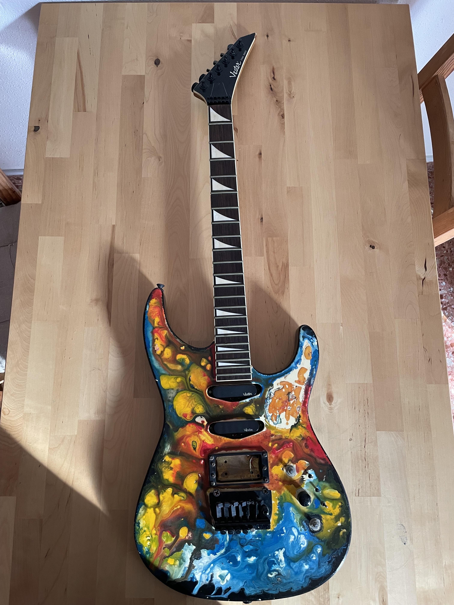

# Vester Stage Series I – Guitar Restoration Project

## General Description

This guitar is a **Vester Stage Series I**, manufactured in Korea by **Saehan Guitar Technology**, likely around **1992–1993**. These models were part of the final and most refined era of Vester production before the brand was discontinued in the mid-90s. Vester guitars from this period are well-regarded for their quality, especially those made in Korea during the late '80s and early '90s.

This particular model features a **Super Strat-style body**, a **sharp Jackson-style headstock**, and an **active electronics system**, making it a rare and versatile instrument with both vintage character and aggressive performance features.

---

## Specifications

### Production Details:
- **Brand:** Vester
- **Series:** Stage Series I
- **Manufactured by:** Saehan Guitar Technology (Korea)
- **Serial Number:** E723536
- **Estimated Year:** 1992–1993
- **Label on Backplate:** “Presented by Saehan Guitar Technology”

### Body & Neck:
- **Body Style:** Stratocaster-inspired Super Strat
- **Color:** Vintage cream
- **Neck:** Bolt-on maple neck
- **Fingerboard:** Likely rosewood or maple (TBD upon disassembly)
- **Frets:** Medium jumbo
- **Headstock:** Jackson-style pointed headstock

### Electronics:
- **Configuration:** HSS (Humbucker - Single - Single)
- **Controls:**
  - 1x Master Volume
  - 2x Tone knobs
  - 3x Mini toggle switches (likely pickup selectors: on/off per pickup)
- **Additional Feature:** **Active preamp** labeled *"Segovia Electrics"*
- **Power:** 9V battery (internal compartment)

### Pickups:
- **Original Vester pickups**:
  - **Bridge:** Humbucker (ceramic magnet, ~10–12k Ohm)
  - **Middle & Neck:** Single-coil (ceramic magnets, ~5–6k Ohm)
- **Type:** Passive
- **Balanced for active signal chain**

### Bridge & Hardware:
- **Bridge Type:** Licensed Floyd Rose-style locking tremolo system
- **Tuners:** Vintage sealed tuners (original, to be evaluated)
- **Hardware Finish:** Chrome (aged)

---

## Preamp Details

- **Label:** Segovia Electrics
- **Chipset:** **M8706 LF442CN** (dual op-amp, JFET input, low-noise)
- **Design Purpose:**
  - Active buffer and signal boost
  - Potential light EQ shaping or signal conditioning
  - Matches well with medium-output passive pickups
- **Power Supply:** 9V battery
- **Circuit Type:** Analog, low-current draw, ideal for guitars

### Observations:
- This op-amp (LF442CN) is known for its clean audio performance and low power consumption, making it perfect for instrument preamps.
- It's most likely a **single-stage boost or buffer**, but exact topology will be confirmed and documented in the wiring diagram.

---

## Current Condition & Restoration Plan

I acquired this guitar in **heavily worn condition**, missing several critical parts and showing signs of neglect and poor modifications over the years. Here is a breakdown of the current state:

- **Missing bone nut**: The original nut is completely gone.
- **Bridge issues**: Two of the tremolo system screws are missing, and the **backplate for the bridge cavity** is also absent.
- **Knobs**: Two of the three control knobs were missing.
- **Bridge pickup**: Had been forcibly removed from its base, wires cut and mounting hardware lost.
- **Finish**: The body had been repainted in a psychedelic style, but the finish was poorly done, with uneven texture and visible brush marks.
- **Binding**: The **white binding** on both the **neck and headstock** is damaged in multiple spots.
- **Fingerboard**: The fretboard is **partially unglued** near the nut, lifting slightly and requiring regluing and clamping.
- **Fret inlays**: Several decorative fretboard inlays are coming loose.
- **Body lamination**: On the back of the body, there's evidence of **delamination** between wooden layers or veneer separation.

---

## Restoration Vision

My goal is to **bring this instrument back to life** while preserving its unique vintage character and original components wherever possible. Here's my approach:

- **Wood repair**: I’ll carefully re-glue and refinish all damaged wooden sections, including the body lamination and fretboard.
- **Refinishing**: Ideally, I’d like to restore its **original cream finish**. However, if this proves unfeasible, I may opt to **strip the paint and highlight the natural wood grain** with a transparent or satin finish.
- **Part recovery**: I’ll attempt to **rebuild or source missing hardware** (e.g., nut, screws, knobs, backplate) using vintage-style parts or custom fabrication if needed.
- **Originality vs. improvement**: My aim is to **retain as many original elements as possible**, but I’m open to implementing **modern upgrades** where necessary — especially in areas where original parts are unsalvageable or compromise playability or sound quality.

This restoration is not just a repair — it's a respectful revival of a rare Korean-made guitar with unique features and vintage soul.

---

## Restoration Progress

### Before Restoration

